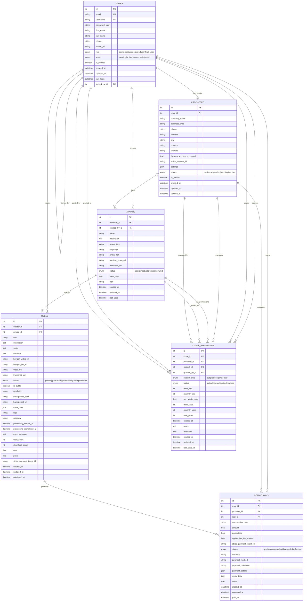

# TIPOS DE USUARIOS DEL NUEVO MÓDULO DE HEYGEN DE PASSPORTAI.APP

Documento para: **Emiliano (líder del proyecto)**  
Ámbito: **app independiente** del módulo HeyGen.  
Cobro en la POC: **Stripe Connect · Direct charges + `application_fee`** (el Productor cobra en su propio Stripe; la plataforma percibe un plus por operación).

---

## 1) Roles y objetivos

### A. Admin (full)
**Objetivo:** gobierno total de la app.  
**Permisos clave:** alta/baja y roles de usuarios; políticas; métricas/errores; configuración de webhooks globales; auditoría.  
**Notas RBAC:** separar **usuarios ↔ roles ↔ permisos**; asignación muchos-a-muchos y **least-privilege** (modelo RBAC estándar).

### B. Productor (socio de negocios)
**Objetivo:** operar con **su cuenta de HeyGen** y **su Stripe**.  
**Permisos clave:**
- Conectar/rotar **API key de HeyGen**; ver consumo.  
- **Crear/editar/borrar CLONES (avatares)**; **dar permisos por CLONE** a Subproductores y Usuarios Finales.  
- Definir **límites de uso** (diario/mensual/por avatar) para cada Subproductor/Usuario Final.  
- Conectar **Stripe (Connect)**; cobrar directo (*Direct charges*) y la plataforma toma **`application_fee`**.  
**Base técnica HeyGen:** generar videos con avatar por API y seguir estados vía **webhooks** de `completed/failed` (recomendados para integraciones asíncronas).

### C. Subproductor (afiliado del Productor)
**Objetivo:** operar **en nombre del Productor**, consumiendo **sus** créditos.  
**Permisos clave:**
- **Usar la API key del Productor**.  
- **Crear nuevos CLONES** (si el Productor lo habilita).  
- Crear/editar **guiones** y **jobs**; administrar **assets asignados**.  
**Restricciones:** no ve ni rota la key; no gestiona precios/Stripe; sujeto a **cuotas** y a **permisos por CLONE** (principio de mínimo privilegio).

### D. Usuario Final
**Objetivo:** crear **reels/videos** usando **solo** CLONES a los que el Productor le dio permiso.  
**Permisos clave:** generar y descargar **sus** resultados; sin acceso a claves ni a clones no autorizados.  
**Facturación:** compra al **Productor** (merchant); la plataforma cobra el **plus** como **`application_fee`** del cargo directo.

### E. CLONES (entidad)
**Definición:** cada **avatar** disponible del Productor.  
**Ciclo:** crear (Productor/Subproductor) → aprobar (opcional) → asignar permisos → usar en renders → revocar.  
**API HeyGen:** selección de avatar/voz y generación; consulta/listado de videos y estados.

---

## 2) Matriz de permisos (MVP)

| Recurso / Acción | Admin | Productor | Subproductor | Usuario Final |
|---|---:|---:|---:|---:|
| Conectar/rotar **HeyGen API key** | ✓ | ✓ | — | — |
| Crear **CLONE** (avatar) | ✓ | ✓ | ✓ *(si habilitado)* | — |
| Asignar permisos por **CLONE** | ✓ | ✓ | — | — |
| Crear **job** (texto→video) | ✓ | ✓ | ✓ | ✓ *(solo CLONES permitidos)* |
| Ver/descargar **assets** del Productor | ✓ | ✓ | ✓ *(si asignado)* | ✓ *(solo propios)* |
| Borrar **CLONE** | ✓ | ✓ | — | — |
| Definir **límites/cuotas** | ✓ | ✓ | — | — |
| Conectar **Stripe** | — | ✓ | — | — |
| Ver **costos/uso** del Productor | ✓ | ✓ | — | — |

> RBAC: roles↔permisos desacoplados + least-privilege.

---

## 3) Permisos por CLONE (política imprescindible)

- **ACL por avatar**  
  `clone_permissions = { clone_id, productor_id, allowed_users[], allowed_subproductores[], limits{daily, monthly, per_render}, status{active|paused} }`.
- **Regla de resolución:** *permitir* si el actor **está autorizado** para ese CLONE **y** no superó **límites** **y** el CLONE está **activo**.  
- **Auditoría:** log por `job_id`, `clone_id`, `actor_id`, `status HeyGen` y `error` (si aplica). Estados y errores se obtienen vía API/webhooks.

---

## 4) Modelo de datos mínimo

- `producers` { id, owner_user_id, **heygen_api_key (encrypted)**, **stripe_account_id**, settings }  
- `subproducers` { id, producer_id, user_id, **can_create_clones:boolean**, quotas{daily,monthly} }  
- `final_users` { id, producer_id, user_id }  
- `clones` { id, producer_id, name, **avatar_ref (heygen)**, status, created_by }  
- `clone_permissions` { clone_id, subject_type('subproducer' \| 'user'), subject_id, limits }  
- `jobs` { id, producer_id, actor_id, clone_id, script, **heygen_job_id**, status, **video_url** }  
- `webhooks` { id, provider('heygen' \| 'stripe'), secret_hash, url, enabled }  
- `billing_events` { id, producer_id, final_user_id, job_id, amount, **application_fee_amount**, currency, stripe_payment_intent, status }

---

## 5) Flujos clave

### A) Render (Texto → Video)
1. Actor (Subproductor o Usuario Final) elige **CLONE permitido** y envía `script`.  
2. Servicio crea **job** vía API de HeyGen, guarda `heygen_job_id` y `status = queued/processing`.  
3. **Webhook HeyGen** → `completed/failed` + `video_url` → actualizar `jobs` y notificar. *(La validación de HeyGen hace un `OPTIONS` de ~1s; el endpoint debe aceptarlo y responder rápido).*

### B) Cobro (POC de tracción)
- **Stripe Connect · Direct charges**: el cargo se procesa **en la cuenta del Productor**; la plataforma toma **`application_fee_amount`** (debe ser **positivo y menor** al monto del cargo).  
- Alternativas futuras: **Destination charges** o **Separate charges & transfers** si necesitás checkout unificado y mayor control operativo.

---

## 6) Seguridad operativa (mínimos MVP)

- **Webhooks firmados e idempotentes** (HeyGen y Stripe): los proveedores pueden reenviar eventos; validar firma/fecha y evitar procesar duplicados.  
- **Rotación de secretos** (HeyGen/webhooks) y **cifrado en reposo** para API keys.  
- **Rate limiting** por Productor/CLONE; reintentos con backoff en errores recuperables.  
- **Trazabilidad** end-to-end por `job_id` (request → webhook → asset).

---

## 7) Referencias técnicas (enlace directo)

- HeyGen • **Create Avatar Videos**: https://docs.heygen.com/docs/create-video  
- HeyGen • **Webhook Events** (incluye validación `OPTIONS`): https://docs.heygen.com/docs/using-heygens-webhook-events  
- HeyGen • **Add a Webhook Endpoint** (REST): https://docs.heygen.com/reference/add-a-webhook-endpoint  
- HeyGen • **Create Avatar Video (V2)** (callback vs webhook): https://docs.heygen.com/reference/create-an-avatar-video-v2  
- Stripe Connect • **Direct charges** + `application_fee`: https://docs.stripe.com/connect/direct-charges  
- Stripe Connect • **Destination charges**: https://docs.stripe.com/connect/destination-charges  
- Stripe Connect • **Separate charges & transfers**: https://docs.stripe.com/connect/separate-charges-and-transfers  
- NIST CSRC • **Role-Based Access Control (RBAC)**: https://csrc.nist.gov/projects/role-based-access-control

---

> **Nota:** Este README define sólo el **modelo de usuarios y permisos** del módulo HeyGen independiente. La orquestación con el resto de passportai.app se realizará vía API/Gateway, reutilizando autenticación y trazabilidad comunes cuando corresponda.

